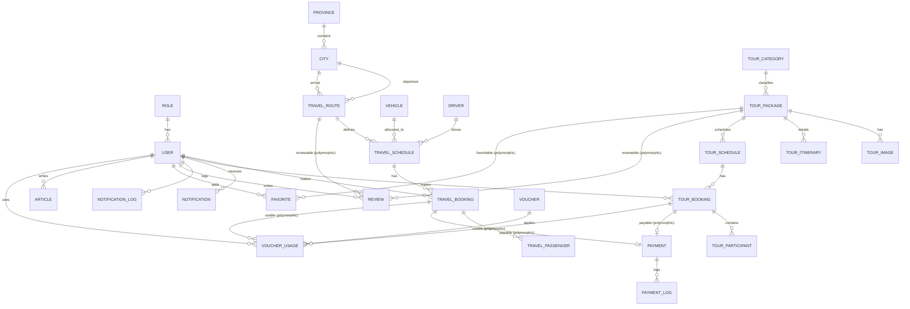

# Database Relationship Diagram - GMM Travel

Below is the entity-relationship diagram for the production-ready database schema of GMM Travel, constructed with Laravel 12 migration relationships.

## Entity Relationship Diagram (Mermaid)

## Schema Details

### Master Data Layer
*   **Users & Roles**: Admin, User, and Driver roles are defined. Users use UUID as primary key and relate to roles.
*   **Location**: System uses Provinces and Cities to locate destinations and define travel routes.
*   **Logistics**: Vehicles (like Toyota Hiace Commuter/Premio) and Drivers are managed separately for scheduling.

### Travel Layer (Point-to-Point Booking)
*   **Travel Route**: Links departure city and arrival city with distance and duration details.
*   **Travel Schedule**: Connects a vehicle, route, and driver to a specific departure and arrival time.
*   **Travel Booking**: Standard booking schema with soft deletes, unique booking codes, and list of passengers.

### Tour Layer (Package Tourism)
*   **Tour Package**: Curated trip details with description, meeting point, inclusions/exclusions, terms, and itineraries.
*   **Tour Schedule**: Specific batch departures for a package.
*   **Tour Booking**: Booking records for specific slots with participant lists.

### Payment Layer (Transactions & Promotion)
*   **Payment**: Uses polymorphic `payable` relation to links to both `TravelBooking` and `TourBooking`. Incorporates invoice number, gateway indicators (Midtrans/Xendit), snap tokens, transaction states, and timestamps.
*   **Voucher & VoucherUsage**: Promo logic that tracks usage linked to user and specific bookings polymorphically.
